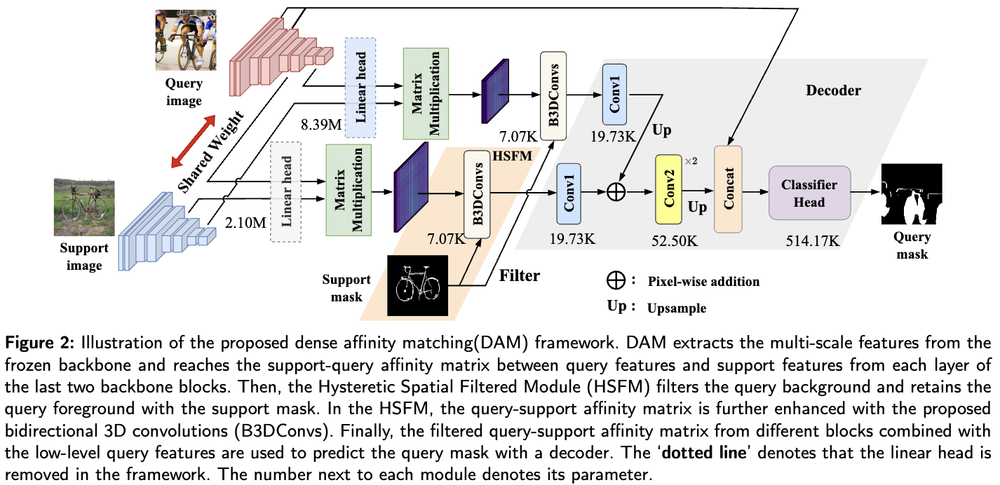

## PMNet(WACV2024) and DAM(Neucom)
Official code for Pixel Matching Network and Dense Affinity Matching (DAM) network.

<p align="middle">
    
</p>

## Requirements

- Python 3.7
- PyTorch 1.5.1
- cuda 10.1
- tensorboard 1.14

Conda environment settings:

```bash
conda create -n DAM python=3.7
conda activate DAM

conda install pytorch=1.7.1 torchvision cudatoolkit=10.1 -c pytorch
conda install -c conda-forge tensorflow
pip install tensorboardX
```

## Prepare Datasets

Download COCO2014 train/val images and annotations: 

```bash
wget http://images.cocodataset.org/zips/train2014.zip
wget http://images.cocodataset.org/zips/val2014.zip
wget http://images.cocodataset.org/annotations/annotations_trainval2014.zip
```

Create a directory 'datasets' and appropriately place coco to have following directory structure:

    datasets/
        └── COCO2014/           
            ├── annotations/
            │   ├── train2014/  # (dir.) training masks
            │   ├── val2014/    # (dir.) validation masks
            │   └── ..some json files..
            ├── train2014/
            └── val2014/

## Prepare backbones

Downloading the following pre-trained backbones:

> 1. [ResNet-50](https://github.com/rwightman/pytorch-image-models/releases/download/v0.1-rsb-weights/resnet50_a1h-35c100f8.pth) pretrained on ImageNet-1K by [TIMM](https://github.com/rwightman/pytorch-image-models)
> 2. [ResNet-101](https://github.com/rwightman/pytorch-image-models/releases/download/v0.1-rsb-weights/resnet101_a1h-36d3f2aa.pth) pretrained on ImageNet-1K by [TIMM](https://github.com/rwightman/pytorch-image-models)
> 3. [Swin-B](https://github.com/SwinTransformer/storage/releases/download/v1.0.0/swin_base_patch4_window12_384.pth) pretrained on ImageNet-1K by [Swin-Transformer](https://github.com/microsoft/Swin-Transformer)

Create a directory 'backbones' to place the above backbones. The overall directory structure should be like this:

    ../                         # parent directory
    ├── DAM/                    # current (project) directory
    │   ├── common/             # (dir.) helper functions
    │   ├── data/               # (dir.) dataloaders and splits for each FSS dataset
    │   ├── model/              # (dir.) implementation of DAM
    │   ├── scripts/            # (dir.) Scripts for training and testing
    │   ├── README.md           # intstruction for reproduction
    │   ├── train.py            # code for training
    │   └── test.py             # code for testing
    ├── datasets/               # (dir.) Few-Shot Segmentation Datasets
    └── backbones/              # (dir.) Pre-trained backbones

## Train and Test
You can use our scripts to build your own. Training will take approx. 1.5 days until convergence (trained with four V100 GPUs). For more information, please refer to ./common/config.py

> ```bash
> sh ./scripts/train.sh
> ```
> 
> - For each experiment, a directory that logs training progress will be automatically generated under logs/ directory. 
> - From terminal, run 'tensorboard --logdir logs/' to monitor the training progress.
> - Choose the best model when the validation (mIoU) curve starts to saturate. 

For testing, you have to prepare a pretrained model. 
> ```bash
> sh ./scripts/test.sh
> ```
> 

## BibTeX
If you are interested in our paper, please cite:
```
@InProceedings{Chen_2024_WACV,
    author    = {Chen, Hao and Dong, Yonghan and Lu, Zheming and Yu, Yunlong and Han, Jungong},
    title     = {Pixel Matching Network for Cross-Domain Few-Shot Segmentation},
    booktitle = {Proceedings of the IEEE/CVF Winter Conference on Applications of Computer Vision (WACV)},
    month     = {January},
    year      = {2024},
    pages     = {978-987}
}
```
```
@article{CHEN2024127348,
title = {Dense affinity matching for Few-Shot Segmentation},
journal = {Neurocomputing},
volume = {577},
pages = {127348},
year = {2024},
issn = {0925-2312},
author = {Hao Chen and Yonghan Dong and Zheming Lu and Yunlong Yu and Yingming Li and Jungong Han and Zhongfei Zhang}
}
```

